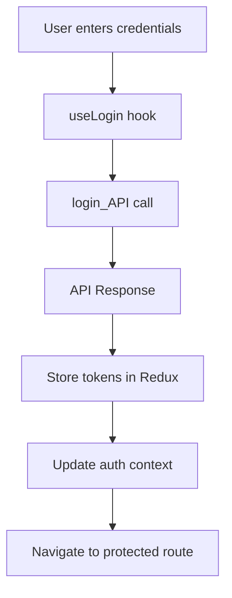
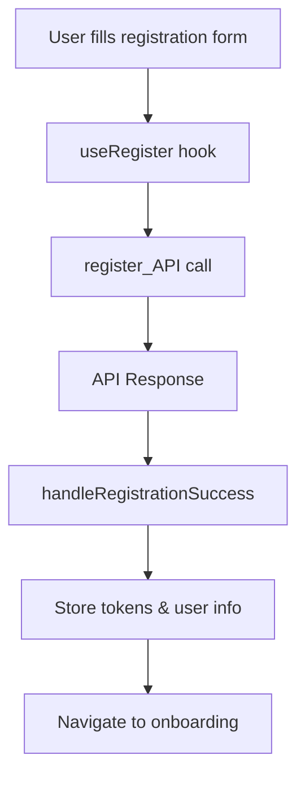
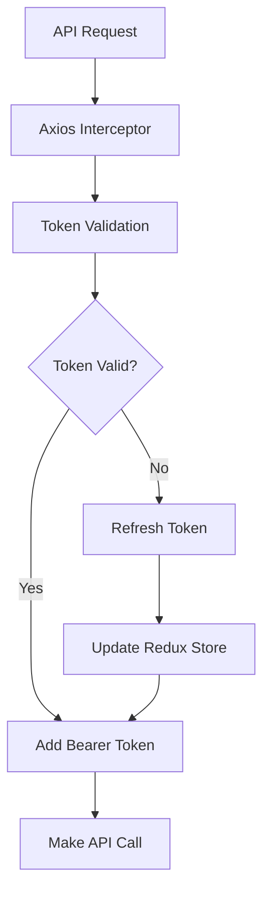

# API Integration System

This directory contains the API integration system for the application, including authentication, token management, and service patterns.

## 🏗️ Architecture Overview

The API system is built with the following components:

1. **Centralized Configuration** (`config/api.endpoints.ts`)
2. **Services** (`services/`)
3. **Hooks** (`hooks/`)
4. **Types** (`types/`)
5. **Utilities** (`utils/`)

## 🚀 Quick Start

### 1. Authentication

```typescript
// Login
import { useLogin } from '../../hooks/use_auth';

const { mutate: login, isPending } = useLogin();

login({ email, password }, {
  onSuccess: (response) => {
    // Handle successful login
    console.log('Login successful', response);
  },
  onError: (error) => {
    // Handle login error
    console.error('Login failed', error);
  }
});
```

### 2. Registration

```typescript
// Register
import { useRegister } from '../../hooks/use_auth';

const { mutate: register, isPending } = useRegister();

register(registrationData, {
  onSuccess: (response) => {
    // Handle successful registration
    handleRegistrationSuccess(response);
  },
  onError: (error) => {
    // Handle registration error
    setError(error.message);
  }
});
```

### 3. Token Management

```typescript
// Access tokens
import { useAuth, useTokens } from '../../hooks/use_auth';

const { accessToken, refreshToken, isAuthenticated } = useAuth();
const { hasTokens } = useTokens();

// Utility functions
import { getAccessToken, isAuthenticated, getAuthHeader } from '../utils/auth.utils';

const token = getAccessToken();
const authHeader = getAuthHeader(); // { Authorization: 'Bearer token' }
```

## 📁 File Structure

```
src/lib/
├── config/
│   └── api.endpoints.ts      # Centralized API endpoints
├── services/
│   ├── auth.service.tsx      # Authentication APIs
│   ├── example.service.ts    # Example service template
│   └── README.md            # This file
├── hooks/
│   └── use_auth.ts          # Authentication hooks
├── types/
│   ├── user.type.ts         # User and auth types
│   ├── api.type.ts          # API response types
│   └── index.ts             # Type exports
├── utils/
│   ├── api.util.ts          # Axios instance with interceptors
│   ├── auth.utils.ts        # Auth utility functions
│   └── token.util.ts        # Token validation utilities
└── store/
    └── reducers/
        └── auth.reducer.ts  # Redux auth state
```

## 🔧 API Service Pattern

All API services follow a consistent pattern:

### 1. Service File Structure

```typescript
// services/example.service.ts
import axiosInstance from '../utils/api.util';
import { API_ENDPOINTS } from '../config/api.endpoints';
import { API_SuccessPayload } from '../types';

// Types
export interface ExampleItem {
  id: string;
  name: string;
}

export interface CreateExampleRequest {
  name: string;
}

// Service functions
export const getExamples_API = async (params?: SearchParams) => {
  return axiosInstance.get<API_SuccessPayload<ExampleItem[]>>('/api/examples');
};

export const createExample_API = async (data: CreateExampleRequest) => {
  return axiosInstance.post<API_SuccessPayload<ExampleItem>>('/api/examples', data);
};
```

### 2. Hook Pattern

```typescript
// hooks/use_examples.ts
import { useQuery, useMutation } from '@tanstack/react-query';
import { getExamples_API, createExample_API } from '../services/example.service';

export const useExamples = (params?: SearchParams) => {
  return useQuery({
    queryKey: ['examples', params],
    queryFn: () => getExamples_API(params),
  });
};

export const useCreateExample = () => {
  return useMutation({
    mutationFn: createExample_API,
    onSuccess: () => {
      queryClient.invalidateQueries({ queryKey: ['examples'] });
    },
  });
};
```

### 3. Component Usage

```typescript
// components/ExampleList.tsx
import { useExamples, useCreateExample } from '../hooks/use_examples';

const ExampleList = () => {
  const { data: examples, isLoading } = useExamples();
  const { mutate: createExample } = useCreateExample();

  const handleCreate = () => {
    createExample({ name: 'New Example' });
  };

  return (
    <div>
      {isLoading ? 'Loading...' : examples?.map(item => <div key={item.id}>{item.name}</div>)}
      <button onClick={handleCreate}>Create</button>
    </div>
  );
};
```

## 🔐 Authentication Flow

### 1. Login Process



### 2. Registration Process



### 3. Token Management



## 🛠️ Creating New Services

### 1. Add Endpoints

```typescript
// config/api.endpoints.ts
export const API_ENDPOINTS = {
  // ... existing endpoints
  PRODUCTS: {
    LIST: '/products',
    GET_BY_ID: (id: string) => `/products/${id}`,
    CREATE: '/products',
    UPDATE: (id: string) => `/products/${id}`,
    DELETE: (id: string) => `/products/${id}`,
    SEARCH: '/products/search',
  },
};
```

### 2. Create Service

```typescript
// services/product.service.ts
import axiosInstance from '../utils/api.util';
import { API_ENDPOINTS } from '../config/api.endpoints';
import { API_SuccessPayload } from '../types';

export interface Product {
  id: string;
  name: string;
  price: number;
}

export const getProducts_API = async () => {
  return axiosInstance.get<API_SuccessPayload<Product[]>>(API_ENDPOINTS.PRODUCTS.LIST);
};

export const createProduct_API = async (data: CreateProductRequest) => {
  return axiosInstance.post<API_SuccessPayload<Product>>(API_ENDPOINTS.PRODUCTS.CREATE, data);
};
```

### 3. Create Hooks

```typescript
// hooks/use_products.ts
import { useQuery, useMutation } from '@tanstack/react-query';
import { getProducts_API, createProduct_API } from '../services/product.service';

export const useProducts = () => {
  return useQuery({
    queryKey: ['products'],
    queryFn: getProducts_API,
  });
};

export const useCreateProduct = () => {
  return useMutation({
    mutationFn: createProduct_API,
  });
};
```

## 📝 Best Practices

### 1. Error Handling

```typescript
// Always handle errors in hooks
const { mutate: createItem } = useCreateItem();

createItem(data, {
  onSuccess: (response) => {
    toast.success('Item created successfully');
  },
  onError: (error) => {
    const message = error.response?.data?.message || 'Failed to create item';
    toast.error(message);
  }
});
```

### 2. Loading States

```typescript
// Use loading states for better UX
const { mutate: createItem, isPending } = useCreateItem();

return (
  <button disabled={isPending}>
    {isPending ? 'Creating...' : 'Create Item'}
  </button>
);
```

### 3. Query Invalidation

```typescript
// Invalidate related queries after mutations
export const useUpdateItem = () => {
  const queryClient = useQueryClient();
  
  return useMutation({
    mutationFn: updateItem_API,
    onSuccess: () => {
      queryClient.invalidateQueries({ queryKey: ['items'] });
    },
  });
};
```

### 4. Type Safety

```typescript
// Always use proper TypeScript types
interface CreateItemRequest {
  name: string;
  description: string;
}

interface ItemResponse {
  id: string;
  name: string;
  description: string;
  createdAt: string;
}

export const createItem_API = async (data: CreateItemRequest) => {
  return axiosInstance.post<API_SuccessPayload<ItemResponse>>('/api/items', data);
};
```

## 🔧 Available Utilities

### Authentication Utils

```typescript
import { 
  getAccessToken, 
  getRefreshToken, 
  isAuthenticated, 
  getAuthHeader 
} from '../utils/auth.utils';

// Get current tokens
const token = getAccessToken();
const refreshToken = getRefreshToken();

// Check authentication status
const isAuth = isAuthenticated();

// Get auth header for manual requests
const authHeader = getAuthHeader();
```

### Query Parameter Building

```typescript
import { buildQueryParams } from '../config/api.endpoints';

const params = { page: 1, limit: 10, search: 'query' };
const queryString = buildQueryParams(params);
// Result: "page=1&limit=10&search=query"
```

## 🚨 Common Issues

### 1. Token Expiry

- Tokens are automatically refreshed by the axios interceptor
- Failed refresh attempts will trigger logout
- Use `tokenValidation()` for manual token checks

### 2. CORS Issues

- Ensure `withCredentials: true` is set in axios config
- Backend must support credentials in CORS headers

### 3. Type Mismatches

- Always wrap API responses in `API_SuccessPayload<T>`
- Use proper request/response types for each endpoint

## 📚 Additional Resources

- [React Query Documentation](https://tanstack.com/query/latest)
- [Axios Documentation](https://axios-http.com/)
- [Redux Toolkit Documentation](https://redux-toolkit.js.org/)
- [TypeScript Best Practices](https://typescript-eslint.io/rules/)

## 🤝 Contributing

When adding new API endpoints:

1. Add endpoint to `api.endpoints.ts`
2. Create service function in appropriate service file
3. Add TypeScript types for request/response
4. Create React Query hooks
5. Update this README with examples
6. Add error handling and loading states
7. Test the integration thoroughly

---

**Note:** This system is designed to be scalable and maintainable. Follow the established patterns for consistency and easier debugging. 